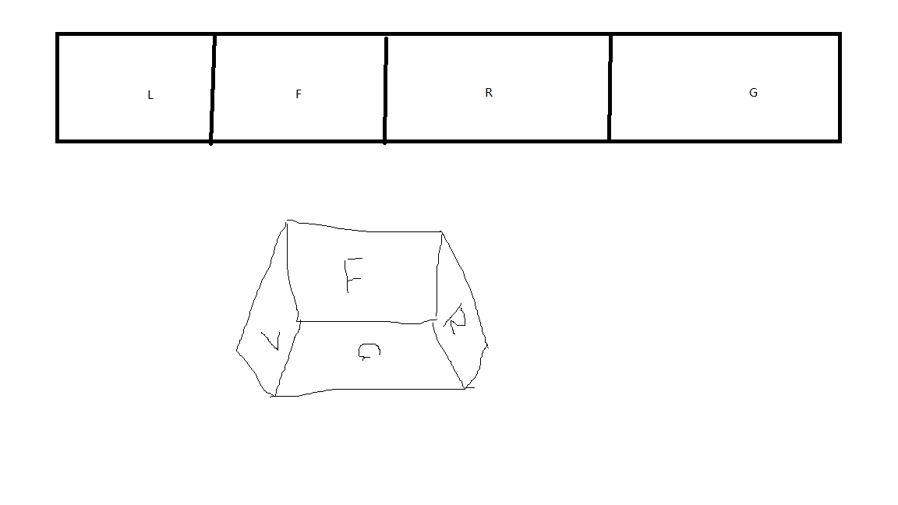

# Cave_LFRG_DrawLines
 by processing and python,for four wall(left,front,right,ground)
 
 result image :
 
# step
1.	run drawLines\drawLines.pde with [processing](https://processing.org/download)
	-	you need set desktop solution ,it's name is "_width" and "_height";
	-	you need set projectors count ,it's name is "projectorColumnCount" and "projectorRowCount";
	-	you need set real line distance on code ,it's name is "lineDis",it unit is meter;
	-	you need set real space on code , realSize.x= front wall width, realSize.y= front wall height, realSize.z= left wall width,it unit is meter;
	-	run it
	-	press L R F G to gen image for wall 
	-	on this step you will get image : left.png front.png right.png ground.png 
2.	run MergeImage.py with python
	-	on this step ,you need use pip install pillow
	-	you will get image : result.png
3.	set result.png as window background;